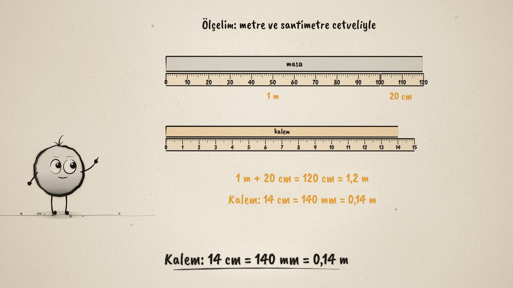
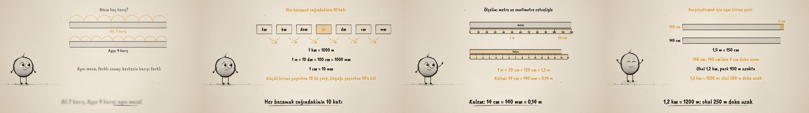

# Kaç Metre? · Standard Units of Length

**▶ Tarayıcıda izleyin / Watch in the browser:** https://hakanatas.github.io/kac-metre/ 
**⬇ MP4 + altyazılar / MP4 + subtitles:** [Releases](https://github.com/hakanatas/kac-metre/releases) 
**✎ Kullanılan istem / The prompt behind it:** [PROMPT.md](PROMPT.md) 
**🎞 Bütün filmler / All films:** [Nokta'nın Filmleri](https://hakanatas.github.io/nokta-filmleri/?sinif=6)

> **TR —** 6. sınıf matematik "Sayılar ve Nicelikler" temasındaki MAT.6.1.8 öğrenme çıktısı için hazırlanmış, tamamen JavaScript ile çizilen 92 saniyelik mürekkep animasyonu. Ali masayı 7 karış, Ayşe 9 karış ölçüyor: aynı masa, farklı sonuç. Herkesin aynı sonucu bulması için ölçüt birim metre seçiliyor. Birim merdiveni (km, hm, dam, m, dm, cm, mm) her basamakta 10 kat değişiyor. Masa metre cetveliyle ölçülüyor (1 m + 20 cm = 120 cm = 1,2 m), kalem milimetrik cetvelle (14 cm = 140 mm = 0,14 m). 1,5 m ile 145 cm aynı birime çevrilip karşılaştırılıyor (150 cm, 5 cm daha uzun); okul 1,2 km, park 950 m uzakta. Son olarak duruma uygun birim seçiliyor: kalem için cm, şehirler arası için km. Altyazılar Türkçe, İngilizce ya da ikisi birlikte seçilebilir.

A 92-second ink animation for **6th-grade maths**, drawn entirely with JavaScript on an HTML5 canvas. It is the last film of the first 6th-grade theme. Nokta, the ink character from [The Learning Ink](https://github.com/hakanatas/the-learning-ink), is the guide again. The rulers are drawn by one function (`ruler` in `src/draw/film.js`) that takes a unit size in pixels and a number of sub-ticks, so the same code draws the metre stick in centimetres and the 15 cm ruler in millimetres.

## Learning outcome

MEB, Türkiye Yüzyılı Maarif Modeli, Ortaokul Matematik, 6th grade, "Sayılar ve Nicelikler" theme:

**MAT.6.1.8. Karşılaştığı günlük hayat ya da matematiksel durumlarda standart uzunluk ölçme birimlerini değerlendirebilme**
- a) Uzunluk ölçme birimlerinden metreyi ölçüt olarak belirler.
- b) Standart ölçme birimlerini kullanarak ölçme yapar.
- c) Ölçme sonuçlarını belirlediği ölçme birimleri ile karşılaştırır.
- ç) Karşılaştırmalarına ilişkin yargıda bulunur.

## Scenes

| # | Time | Scene | What happens | Outcome |
|---|---|---|---|---|
| 1 | 0–10 s | Kaç karış? | The same desk is 7 spans for Ali and 9 for Ayşe. | a |
| 2 | 10–28 s | Metre | The metre as the reference; km … mm, ten times at each step; 1 km = 1000 m, 1 m = 100 cm, 1 cm = 10 mm. | a |
| 3 | 28–46 s | Ölçelim | A desk: 1 m + 20 cm = 120 cm = 1.2 m. A pencil: 14 cm = 140 mm = 0.14 m. | b |
| 4 | 46–66 s | Karşılaştır | 1.5 m against 145 cm (150 cm, 5 cm longer); 1.2 km against 950 m (250 m farther). | c, ç |
| 5 | 66–80 s | Uygun birim | cm for a pencil, m for a door, km between cities: the right unit makes the number easy to read. | ç |
| 6 | 80–92 s | Aklında kalsın | The metre, the ten-times ladder, same unit before comparing, a sensible unit. | a–ç |

## Running it

- **Preview:** double-click `index.html` (it works offline).
- **MP4:** run `npm install` once, then `npm run export -- --format=horizontal --captions=tr`.
- **Subtitles and narration:** `npm run srt` writes `out/captions_*.srt` and `narration_notes.txt`.
- **Editing:**
  - Caption text, timings and narration notes: `captions.js`
  - Everything on screen is drawn by `LI.world(t)` in `scenes/scene1.js` (spans, the ladder, the desk and pencil, the ribbons, the unit choices); the other scenes only set the camera.
  - Bars, rulers, the unit ladder and Nokta's poses: `src/draw/film.js`; layout for 16:9 and 9:16: `src/draw/kd.js`

It uses the same engine as The Learning Ink: `renderFrame(t)` as a pure function of time, seeded randomness, and frame-by-frame export.

## Lisans · License

**TR —** Bu film ve kodu [Creative Commons Atıf-GayriTicari 4.0 Uluslararası (CC BY-NC 4.0)](https://creativecommons.org/licenses/by-nc/4.0/deed.tr) lisansıyla paylaşılır. Ticari olmayan her amaçla (derste, okulda, eğitim materyalinde) kopyalayabilir, paylaşabilir ve değiştirebilirsiniz; ancak **kaynak göstermek zorunludur**: eser sahibinin adı ve bu deponun bağlantısı belirtilmeden kullanılamaz. Ticari kullanım (satış, ücretli ürün ya da yayın) için izin alınmalıdır.

**EN —** This film and its code are licensed under [Creative Commons Attribution-NonCommercial 4.0 International (CC BY-NC 4.0)](https://creativecommons.org/licenses/by-nc/4.0/). You may copy, share and adapt them for non-commercial purposes, but **attribution is required**: they may not be used without crediting the author and linking to this repository. Commercial use requires permission.

Atıf örneği / Required credit: *“Kaç Metre?”, Hakan Ataş, Nokta'nın Filmleri — https://github.com/hakanatas/kac-metre — CC BY-NC 4.0*
